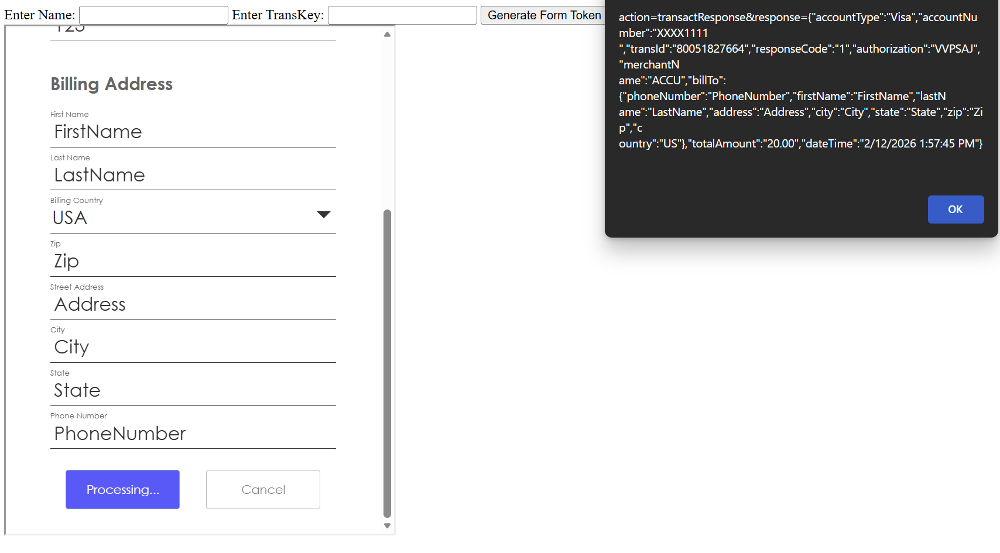

# Blazor.AuthorizeNet

Blazor component for Authorize.Net Accept Hosted, plus two sample apps and a simple form-token generator.

## Prerequisites

- .NET SDK 10.0
- An Authorize.Net account (sandbox or production)

## Authorize.Net registration (sandbox)

1. Create a sandbox account in the Authorize.Net Sandbox portal.
2. In the Merchant Interface, go to **Account → API Credentials & Keys**.
3. Copy the following values (you will use them in the samples):
   - **API Login ID**
   - **Transaction Key** (create one if it does not exist)

For production, use your production Merchant Interface and set `UseSandbox="false"` in the component.

## Required fields (and where to get them)

| Field | Where to get it | Used in | Notes |
|---|---|---|---|
| API Login ID | Merchant Interface → Account → API Credentials & Keys | Form token generation | Required. Enter it as `name` in the sample UI. |
| Transaction Key | Merchant Interface → Account → API Credentials & Keys | Form token generation | Required. Enter it as `transKey` in the sample UI. |
| Return URL base | Your app URL | Form token generation | Must host `empty.html` and `IFrameCommunicator.html` under the site root. |
| Amount | Your business logic | Form token generation | Example uses `20`. |

> The component itself only needs the **form token**. Generating the token requires API Login ID and Transaction Key.

## Run the sample apps

### 1) Server sample (SampleBlazorApp)

This app generates the form token in the UI using the Authorize.Net SDK.

```bash
dotnet run --project src/SampleBlazorApp/SampleBlazorApp.csproj
```

- Open the app URL shown in the console.
- Enter **API Login ID** and **Transaction Key**.
- Click **Generate Form Token** to open the Accept Hosted popup.

### 2) WebAssembly sample (Sample)

This app expects a **form token** to be provided.

```bash
dotnet run --project src/Sample/Sample.csproj
```

- Open the app URL shown in the console.
- Paste a form token into the input.

#### Generate a form token (console)

The `FormTokenGenerator` project is a quick way to create tokens for testing.

1. Update credentials in `FormTokenGenerator/Program.cs`:
   - `name` → API Login ID
   - `Item` → Transaction Key
2. Run:

```bash
dotnet run --project FormTokenGenerator/FormTokenGenerator.csproj
```

3. When prompted, enter your app base URL (e.g., `https://localhost:5001`).
4. Copy the printed token and paste it into the WebAssembly sample.

## Component usage

```razor
<AuthorizeNetAcceptHosted FormToken="@formToken"
                          UseSandbox="true"
                          OnSuccess="HandleSuccess"
                          OnCancel="HandleCancel" />
```

- `FormToken` is required.
- `UseSandbox` should be `true` for sandbox credentials, `false` for production.

## Notes

- `empty.html` and `IFrameCommunicator.html` must be hosted at the site root for the Accept Hosted communication flow.
- If you generate tokens from your own backend, keep your API Login ID and Transaction Key on the server side only.

## Screenshots




